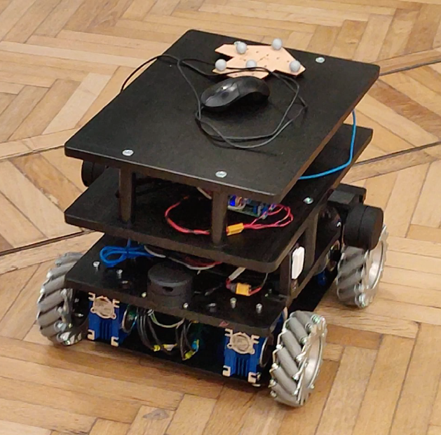
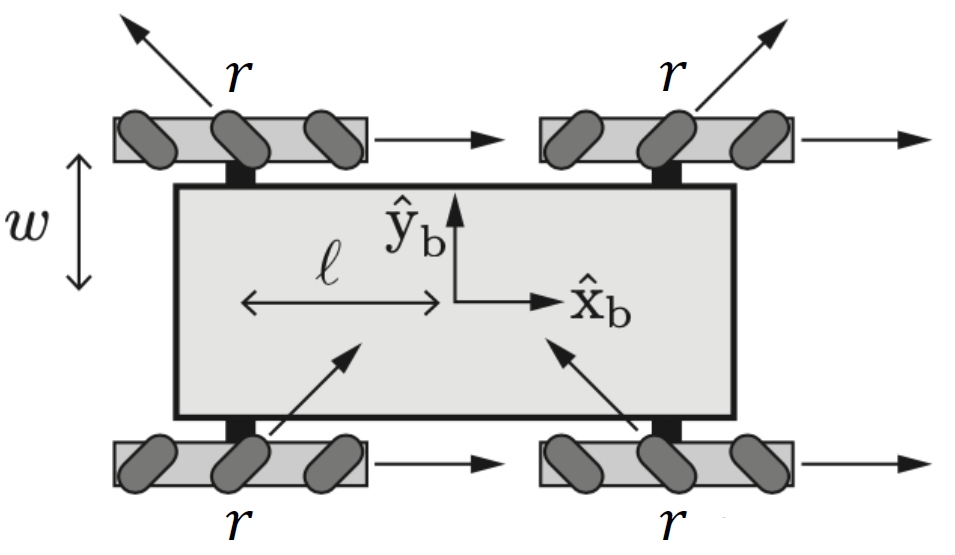
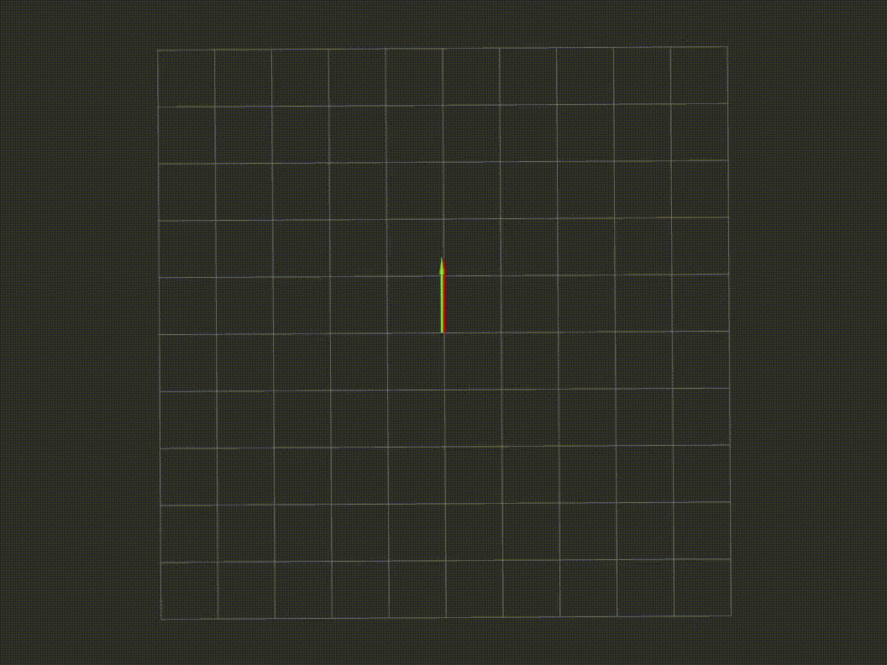
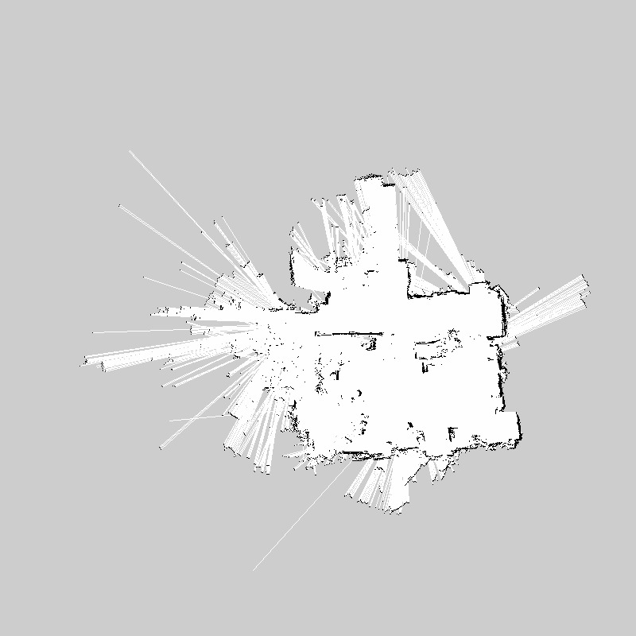

# ROS-robotics-project

## Team
|      Full name       |  Person code   |
|:---------------------|:--------------:|
|Riccardo Izzo         |    10599996    |
|Valentina Abbattista  |    10866105    |
|Ossama El Oukili      |    10865312    |

## Robot characteristics
Robot image             |  Robot scheme
:-------------------------:|:-------------------------:
  |  
* Omnidirectional robot
* 4 mecanum wheels with rollers at 45°
* Encoders on each wheel (RPM or ticks)
* Geometric parameters: wheel radius (r), wheel position along x (l) and wheel position along y (w)
* Data:
  - r = 0.07 m
  - l = 0.200 m
  - w = 0.169 m
  - Gear ratio (T) = 5:1
  - Encoders resolution (N) = 42 CPR (Counts Per Rev.)

## First project - Odometry with ROS
Goals:  
  * Compute odometry using appropriate kinematics ✔️
    - Compute robot linear and angular velocities v,w from wheel encoders
    - Compute odometry using both Euler and Runge-Kutta integration
    - Calibrate robot parameters to match ground truth
  * Compute wheel control speeds from v,w ✔️
  * Add a service to reset the odometry to a specific pose (x, y, ϑ) ✔️ 
  * Use dynamic reconfigure to select between integration method ✔️

Fig.1 - Odometry comparison with rviz

Fig.2 - Odometry comparison with rqt_plot (front right wheel in the example)

## Second project - Mapping and Localization with ROS
Goals:  
  * Create the map ✔️
  * Perform amcl based localization ✔️
  * Write a service to save an image with the map and the trajectory of the robot ✔️  

Fig.3 - Map creation with gmapping

## Sensors
  - [OptiTrack Markers](https://optitrack.com/applications/robotics/)
  - [YDLIDAR G4](https://www.ydlidar.com/products/view/3.html)
  
## Development environment and Tools
  - [Ubuntu 18.04](https://releases.ubuntu.com/18.04/)
  - [ROS Melodic 1.0](http://wiki.ros.org/melodic)
  - [rviz](https://wiki.ros.org/rviz)
  - [gmapping](https://wiki.ros.org/gmapping)
  - [amcl](https://wiki.ros.org/amcl)
  - [OpenCV 3.2.0](https://opencv.org/opencv-3-2/)
