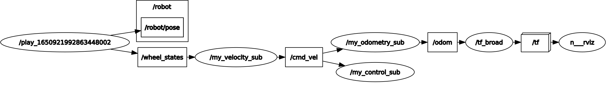
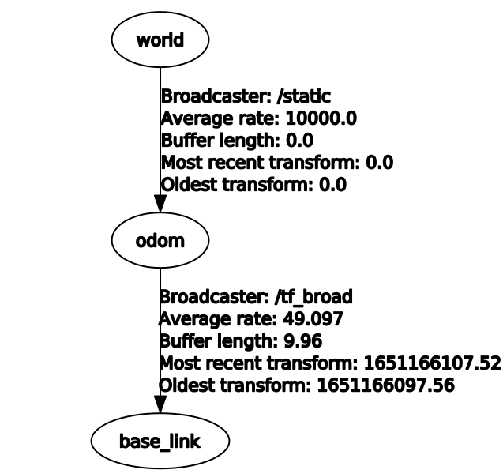

# Robotics - First Project
## Team
|      Full name       |  Person code   |
|:---------------------|:--------------:|
|Riccardo Izzo         |    10599996    |
|Valentina Abbattista  |    10866105    |
|Ossama El Oukili      |    10865312    |

## Files overview
* __assets__: contains images used in the instruction file (README.md)
* cfg
  * __param.cfg__: file used for the "dynamic reconfigure" part, used to change the integration method at runtime without having to restart the node
  * __calibration_param.cfg__: file used to change the robot parameters (N, l, w, r) at runtime, this allow to calibrate them without having to stop the nodes
* include/first_project
  * __Subscriber.h__: header file that contains some function declarations, used by the files in the src folder
* launch
  * __launch.launch__: launch file that start all the nodes of the project and setup the parameters. It also performs a static transformation between odom and world frames, this is useful to use rviz. Finally it starts rviz with a configuration file, at this point is it possible to run a bag to compare the ground pose truth and our odometry.
* msg
  * __Wheels_RPM.msg__: custom message used by Control.cpp to publish the velocities (RPM) of the four wheels on /wheels_rpm topic
* src
  * __Broadcaster.cpp__: manage the dynamic reconfiguration, read the velocities of the four wheels on /odom topic and compute the transformation odom->base_link
  * __Control.cpp__: read Vx, Vy and Wz on /cmd_vel topic, compute the velocities of the four mecanum wheels in RPM and publishes them on /wheels_rpm topic as a Wheels_RPM custom message
  * __Odometry.cpp__:  
    * manage the odometry of the robot: read the angular velocities in /cmd_vel topic, apply one of the integration method available (Euler and Runge-Kutta) and finally publishes it as a nav_msgs/Odometry message on /odom topic
    * manage the reset service that allow to reset the pose of the robot
    * manage the dynamic reconfiguration of the integration method, this allow to dinamically select the integration method between Euler and Runge-Kutta
  * __Velocity.cpp__: read the velocities in ticks (position array) in /wheel_states topic and compute the angular velocity of each wheel.
  Then it computes the longitudinal velocity (Vx), the transversal velocity (Vy) and the angular velocity (Wz), finally it publishes them on /cmd_vel topic as a geometry_msgs/TwistStamped message
* __test.rviz__: configuration file used by rviz

Topic graph when running a bag

## ROS parameters
* __init_x__: initial position on x-axis
* __init_y__: initial position on y-axis
* __init_theta__: initial orientation  
They represent the pose of the robot [x, y, ϑ].  
The default value is 0.0 for all the parameters, they can be set statically on the launch file or dynamically with "rosservice call /reset ecc..." on terminal (example: rosservice call /reset 3.0 3.0 0.0)

## TF tree

* world->odom, static TF to align world and odom frames in order to easily compare the ground truth pose and our odometry results with rviz
* odom->base_link as requested by the last part in first point, this transformation is managed by Broadcaster.cpp

## Custom message
The only custom message is Wheels_RPM.msg that contains the angular velocity of each wheel in RPM. It is managed by Control.cpp that publishes it on /wheels_rpm topic

## How to start/use the nodes
1. Copy the package in your workspace
2. Open a terminal and move to the workspace directory
3. Run "catkin_make"
4. In order to start all the nodes run "roslaunch first_project launch.launch" (if ROS doesn't found the package run "source devel/setup.bash" and repeat the fourth step)

At this point there are several actions available:  
* Run a bag and visualize the odometry with rviz
* Inspect all the topics
* Reset the robot pose with "rosservice call /reset ecc..."
* Dynamically change the integration method with "rosrun rqt_reconfigure rqt_reconfigure", click on "my_odometry_sub" and select Euler or Runge-Kutta
* Dynamically change the robot parameters with "rosrun rqt_reconfigure rqt_reconfigure", click on "my_velocity_sub" and change the values

## Additional info
* Robot parameters calibration  
We first implemented a function to change the robot parameters at runtime, this allowed us to calibrate them without restarting the nodes and without recompiling the code. After we managed to adjust the linear movements in the first bag by simply changing the radius of the wheel. Found a reasonable value we moved to the second and third bag to adjust the rotations by changing l and w parameters.
Finally we verified the final values on all the bags.
* Assumptions
  * initial pose is x = 0, y = 0, ϑ = 0
  * the average height in the bags is 0.25, we used this value as z
* The deltaT considered in the formulas is computed between two sequential messages 