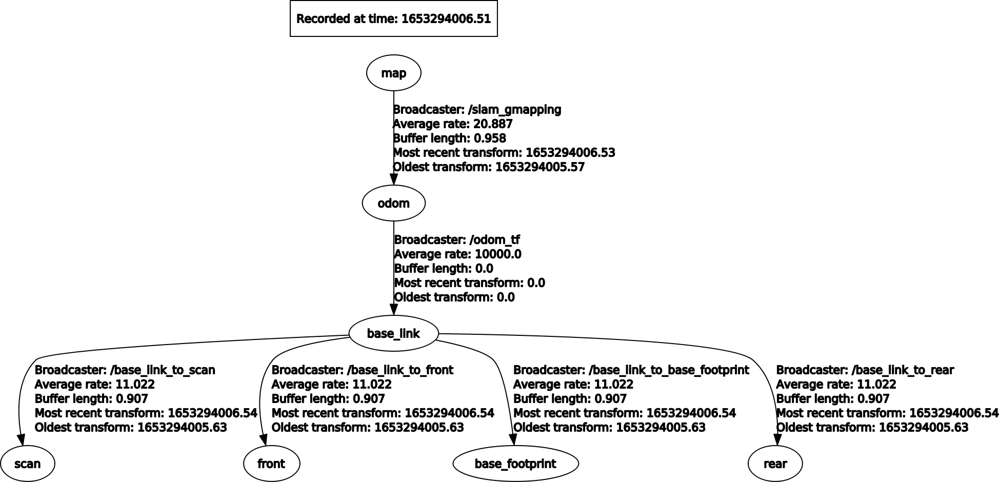

# Robotics - Second Project
## Team
|      Full name       |  Person code   |
|:---------------------|:--------------:|
|Riccardo Izzo         |    10599996    |
|Valentina Abbattista  |    10866105    |
|Ossama El Oukili      |    10865312    |

## Files overview
* assets: contains images used in the instruction file (README.md)
* include/second_project
  * __Subscriber.h__: header file that contains some function declarations, used by the files in the src folder
* config
  * __amcl.launch.xml__: amcl configuration file
  * __gmapping.launch.xml__: gmapping configuration file, some parameters have been tuned with the datasheet of the sensor provided
* launch
  * __localization.launch__: launch file for amcl localization
  * __mapping.launch__: launch file for gmapping, this is used for map creation without the use of a specific node
  * __scan_merger.launch__: launch map that starts ira_laser_tools and merge front and rear lasers
* srv
  * __MapSaver.srv__: service that save the map with the trajectory
* maps
  * __map.pgm__: image of the map
  * __map_with_trajectory.pgm__: image of the map with robot trajectory
  * __map.yaml__: map metadata
* src
  * __odom_tf.cpp__: manage the static TF odom->base_link
  * __trajectory.cpp__: manage the MapSaver service, read the poses from /amcl_pose topic and the map metadata from /map_metadata topic, finally save the map with the robot trajectory using OpenCV library

## TF tree

## Bags management
Create the map: robotics1_final.bag  
Test: robotics2_final.bag and robotics3_final.bag

## How to start/use the nodes
1. Copy the package in your workspace
2. Open a terminal and move to the workspace directory
3. Run "catkin_make"  
At this point there are several actions available:
   * Create the map: 
     1. launch __mapping.launch__ with the first bag (robotics1_final.bag)
     2. from you workspace cd /src/second_project
     3. run "rosrun map_server map_saver -f map" to save the map in the folder second_project
   * Perform amcl based localization: launch __localization.launch__ with a bag (robotics2_final.bag or robotics3_final.bag)
   * Launch service to save an image with the map and the trajectory: 
     1. launch __localization.launch__ with a bag
     2. when the bag is finished call the service with "rosservice call /map_saver", the map with trajectory will be saved in the second_project folder

## Additional info
* Requirements
  * OpenCV 3.2.0
  * ROS packages: cv_bridge, image_transport, ira_laser_tools
* All the maps are saved in the second_project folder
* Run the bags with --clock
